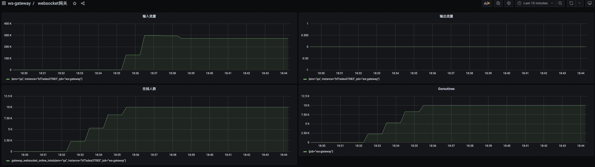
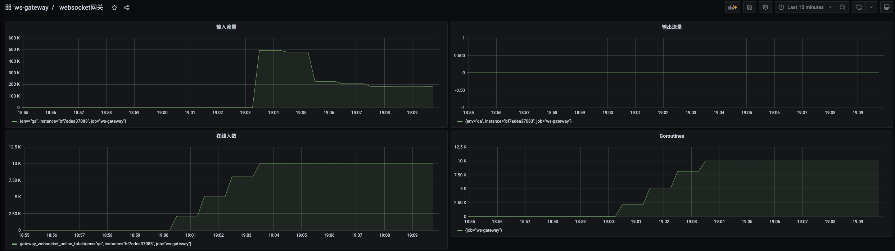
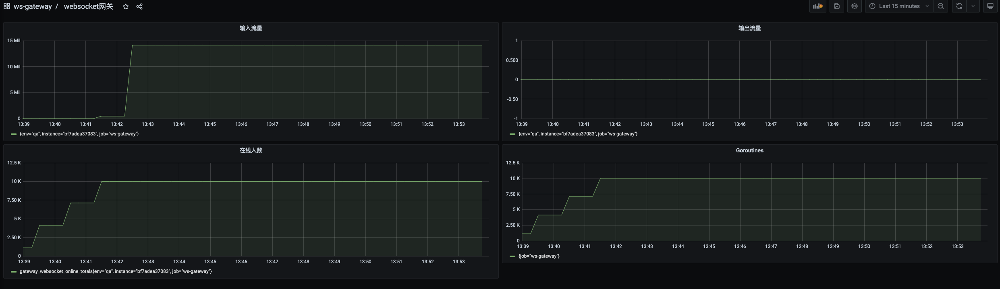

# ws-gateway

## build

### ws-gateway

```bash
docker build --build-arg APP_NAME=ws-gateway -f deploy/docker/Dockerfile -t ws-gateway .
```

### ws-api

```bash
docker build --build-arg APP_NAME=ws-api -f deploy/docker/Dockerfile -t ws-api .
```

## run

```bash
cd deploy/docker-compose
docker-compose up

Starting ws-api ... done
Starting ws-gateway ... done
Attaching to ws-api, ws-gateway
ws-api        | 2022/11/23 15:27:42 maxprocs: Updating GOMAXPROCS=1: determined from CPU quota
ws-api        | 2022/11/23 15:27:42 gRPC server serve :8081
ws-api        | 2022/11/23 15:27:42 gateway [172.20.0.3] gRPC streaming connect
ws-gateway    | 2022/11/23 15:27:42 maxprocs: Updating GOMAXPROCS=1: determined from CPU quota
ws-gateway    | 2022/11/23 15:27:42 HTTP server serve :8080

```

## benchmark
### 安装压测工具
```bash
go get github.com/lyouthzzz/websocket-benchmark-cli@main
```

### case - 1

- websocket客户端：1w
- 发送间隔：1s
- 数据大小：50b
- 单个gRPC Streaming连接

```bash
 websocket-benchmark-cli message --file testdata/50b.txt  --interval 1s --times 10000 --user 10000 --host 127.0.0.1:8080 --path /gateway/ws
```

服务客户端表现稳定

```bash
docker stats ws-gateway

CONTAINER ID   NAME         CPU %     MEM USAGE / LIMIT   MEM %     NET I/O         BLOCK I/O   PIDS
7144b1c4efff   ws-gateway   6.86%     380.4MiB / 2GiB     18.58%    854MB / 593MB   0B / 0B     6
```



### case - 2

- websocket客户端：1w
- 发送间隔：1s
- 数据大小：1k
- 单个gRPC Streaming连接

```bash
websocket-benchmark-cli message --file testdata/1k.txt  --interval 1s --times 10000 --user 10000 --host 127.0.0.1:8080 --path /gateway/ws
```

出现瓶颈，客户端报错：write: connection timed out 原因：服务端处理消息出现瓶颈（可能是 ws-gateway -> ws-api出现问题，
但是内网gRPC-Streaming流量支持不会那么差），导致客户端写入超时。

解决方案：

- ws-gateway -> ws-api benchmark
- 增加ws-api节点



### case-3
- websocket客户端：1w
- 发送间隔：1s
- 数据大小：1k
- 单个gRPC Streaming连接

case-2版本的性能问题发现了，罪魁祸首是锁争用。

https://github.com/lyouthzzz/ws-gateway/blob/main/app/ws-gateway/internal/upstream/grpc_streaming.go#L81

```go
func (upstream *gRPCStreamingUpstream) Send(msg *exchange.Msg) error {
	return upstream.msgc.SendMsg(msg)
}
```

1w个websocket goroutine会调用gRPCStreaming.SendMsg()，里面会存在锁争用问题。

优化方案：
使用chan buffer缓冲（channel实现对锁有做优化手段），增加吞能力。开单独的写goroutine发送消息，避免锁争用。

```go
func NewGRPCStreamingUpstream(opts ...GRPCStreamingUpstreamOption) (Upstream, error) {
    up := &gRPCStreamingUpstream{}
    ...
	
    go up.sendMsg()
    go up.recvMsg()

    return up, nil
}

// todo ??? use chan buffer or send gRPC Streaming sync
func (upstream *gRPCStreamingUpstream) sendMsg() {
	for msg := range upstream.sendMsgChan {
		_ = upstream.msgc.SendMsg(msg)
	}
}
```




## 性能瓶颈

## 优化
- ws-gateway <-> ws-api使用多个gRPC Streaming通道交换数据
